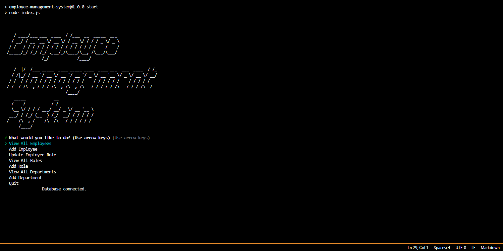

# Employee Management System

## Description
A clean command-line application for managing an employee database.

## Table of Contents
* [Features](#features)
* [Installation](#installation)
* [Usage](#usage)
* [Tests](#tests)
* [Demonstration](#demonstration)

## Features
View and add departmens.
View, add and update job roles.
View and add employees.

## Installation
Clone the repository and install any dependencies with NPM.

## Usage
Run the application and use the keyboard to navigate and enter data.

## Screenshot

## Demonstration
Here is a [Video Demonstration](https://drive.google.com/file/d/1zZGb_DuWFNVV73VZqV5g5R3HXvNX8CiX/view)
